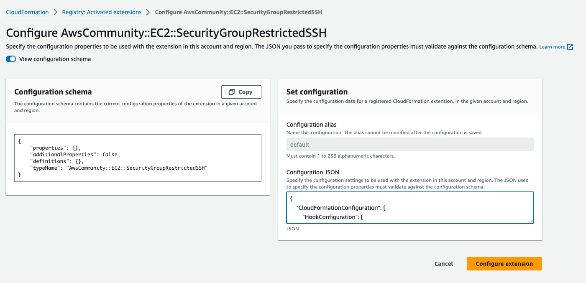

# Stop Your Developers from Creating Noncompliant Resources with AWS CloudFormation Hooks

[](https://www.youtube.com/watch?v=IwEUREOS0NA)

## Introduction

Hello everyone! Thanks for checking out this project. If you have any questions, don't hesitate to reach out to me!

## CloudFormation Template Commands

In the video, there is one command that I use for deploying the CloudFormation template stack into my AWS account using the AWS CLI. The command is highlighted below:
```shell
$ aws cloudformation deploy --stack-name <replace_me> --template-file <replace_me> 
```
>**NOTE**: Add -capabilities CAPABILITY_NAMED_IAM for IAM role deployment

To clean up your stack, enter the following command:

```shell
$ aws cloudformation delete-stack --stack-name <name_of_stack>
```

## CloudFormation Hook Type Configuration

When you get to the part where you're about to activate the `AwsCommunity::EC2::SecurityGroupRestrictedSSH` hook, you'll want to ensure that the
configuration schema is set to the following:

#### Figure 1. Configuration Hooks Dashboard


```json
{
    "CloudFormationConfiguration": {
        "HookConfiguration": {
            "TargetStacks":"ALL",
            "FailureMode":"FAIL"
        }
    }
}
```